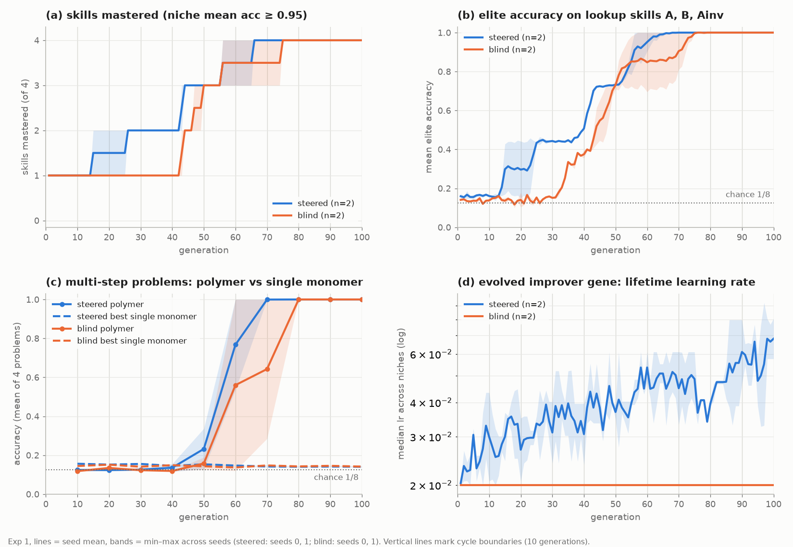
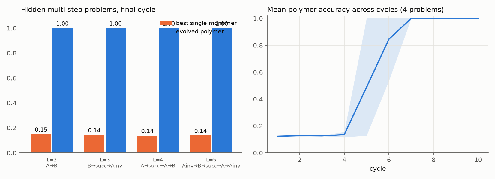
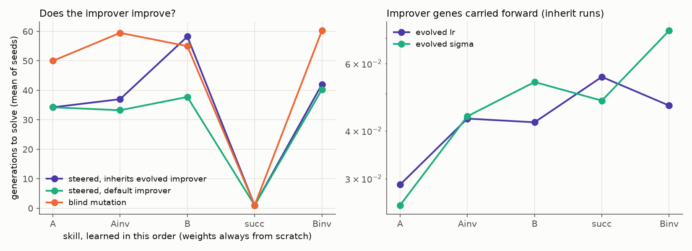
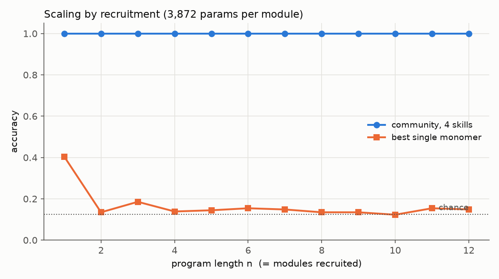
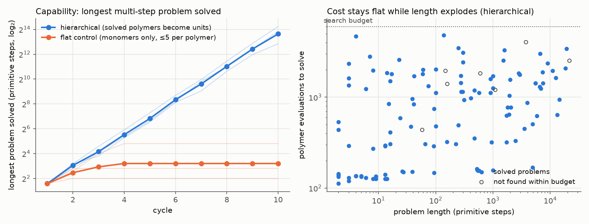
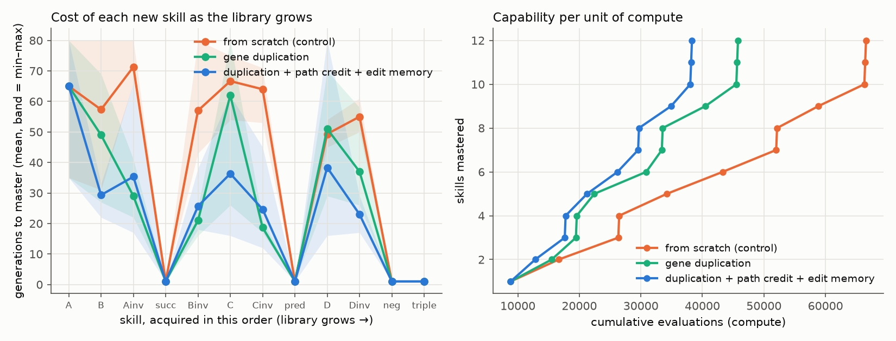
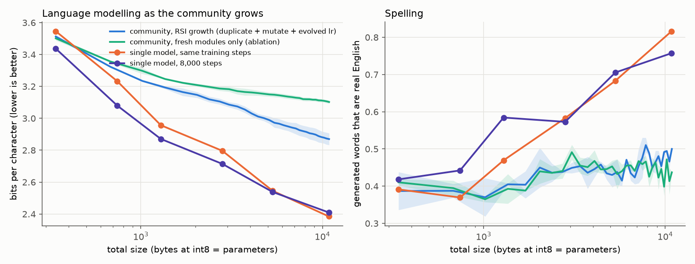
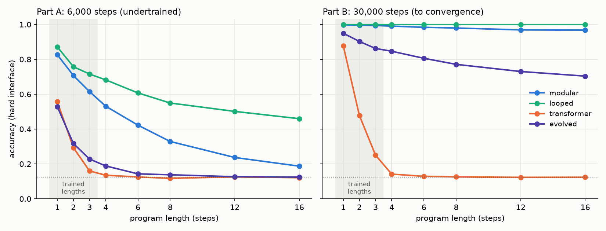

# Modular recursive self-improvement with tiny transformers

**Goal.** Show that (1) a population of *tiny* transformer modules can improve itself
recursively, improving both the solutions and the process that produces them;
(2) the modules can bind into **polymers / communities** that solve problems no single
module can; and (3) this scales: capability grows by recruiting and composing modules,
not by retraining one big model. The long-run motivation is to grow from ~4k-parameter
modules toward very large modular systems.

Everything runs on a 4-core CPU (≈3 hours for the full suite). About **0.55 M monomer
variants** and **1.9 M polymer variants** were generated and evaluated. Every monomer
variant's lineage (id, parent, generation, fitness, improver genes, selected?) is
logged in `results/lineage_*.npz`.



---

## The system

| Piece | What it is |
|---|---|
| **Monomer** (`modrsi/monomer.py`) | 1-layer transformer, 2 heads, MLP, **3,872 parameters**. Reads a context of relation tables and a query symbol, and outputs a distribution over symbols. |
| **Shared interface** (`modrsi/world.py`) | A fixed "genetic code" embedding that every module reads and writes. Because input and output are the same kind of object (a symbol distribution), modules plug into each other with no glue. |
| **Skills (niches)** | `A`, `B` (look x up in table A/B), `Ainv`, `Binv` (reverse lookup), `succ` (x+1). Exp 5 adds tables C, D and `pred`, `neg`, `triple`. One layer can do about **one relational hop**, so a k-step problem is out of reach for any single monomer. |
| **Genome** | Weights + **improver genes** (mutation size σ, drift `m` and spread `a` along the lineage path, spread `b` in the elite subspace, lifetime learning rate `lr`) + an inherited **lineage path** and optimizer state. |
| **Polymer** (`modrsi/polymer.py`) | Ordered chain of ≤5 monomers; each one's output is the next one's query. |
| **Community** | Modules + a tiny evolved router that maps instruction tokens to modules, so it can recruit *n* modules for an *n*-step program. |
| **Macro** (`modrsi/hierarchy.py`) | A polymer that worked, frozen into a new reusable unit. Macros can contain macros. |

### One generation (per niche, `modrsi/evolve.py`)
1. **Vary.** Children copy a parent and mutate:
   `δ/σ = z + (m + a·g)·κ·p̂ + b·Uᵀh`. Here `p̂` is the remembered lineage path, `κ` is how
   consistent that path has been, and `U` is the top directions of recently accepted steps
   across lineages. Variants are concentrated *around the path that worked*.
2. **Develop.** 16 steps of lifetime learning (Adam). Learned weights and optimizer
   state are inherited (Lamarckian).
3. **Select.** (μ+λ) truncation on held-out fitness, plus credit earned inside working polymers.
4. **Remember.** Every variant goes into the lineage log; the paths of selected children
   are extended.

### Where the "recursive" part lives
The improver genes ride along with the weights they produced, so selection acts on
**how the system improves** as well as on what it knows. The design for this went through
three versions, and the failures are part of the result (see *What went wrong*):

* **Island niches (PBT).** Each niche is 4 islands, and each island has one improver.
  Weights are selected every generation within an island. Improvers are compared every
  5 generations, between islands; the losing island copies the winner and perturbs its
  improver.
* **Stress response.** When the progress log shows a plateau, improver genes hypermutate.
  After 15 stagnant generations below mastery, the worst island restarts its weights with
  fresh ones **but keeps the best improver** (the know-how is kept, the stuck solution is not).
* **Path credit (Exp 5).** After each new skill is mastered, the champion's ancestry is
  walked back to its founder through the lineage log. The improver genes along that
  winning branch (discounted 0.9 per step from the leaf) seed the next acquisition.
  The champion's total edit ("module X → skill Y") joins an **edit memory** that later
  mutations explore.

---

## Results

### Exp 1: mutate → polymerize → dissociate cycles (3 seeds × steered/blind, 100 generations)
`python run.py main --mode steered|blind --seed S`

| | steered (islands + path memory) | blind (fixed σ, fixed lr, isotropic) |
|---|---|---|
| Generations to master a lookup skill (9 niche-runs) | **43.0** (15–66) | 54.9 (43–75) |
| Fraction of new variants already successful (acc ≥ 0.9), mean over all generations | **0.57** | 0.47 |
| All 4 skills mastered | 3/3 seeds | 3/3 seeds |

* Steered leaves chance about 25 generations before blind and keeps its lead to 100%
  (figure above, panel b). There is **no final plateau**.
* The evolved learning rate climbs from 0.02 to about 0.06 (panel d): the improver
  learns to learn faster.
* **Caveat:** "steered" and "blind" differ in several ways at once (islands with
  PBT-selected improvers, lineage-path mutation, evolved learning rate, restarts). No
  ablation here isolates the lineage-path steering itself, and lifetime learning (Adam)
  does most of the weight learning. The mutation-only version could not learn lookup at all.
* **Polymers solve what monomers can't.** On the four hidden multi-step problems
  (`A→B`, `B→succ→Ainv`, `A→succ→A→B`, `Ainv→B→succ→A→Ainv`), evolved polymers reach
  **1.00** accuracy in every seed. The best single monomer scores **0.14**, which is
  chance (0.125). Polymers are often functionally equivalent rather than literal; for
  example `A→B` was found as `A,B,A,Ainv`, where the last two cancel.



### Exp 2: does the improver improve? (4 seeds, 5 skills learned in sequence)
`python run.py curriculum --improver inherit|fresh|blind --seed S`

| Generations to learn A, Ainv, B, succ, Binv | total (mean of 4 seeds) |
|---|---|
| steered, default improver for each skill | **146.5** |
| steered, *inheriting* the previous skill's evolved improver | 172.5 |
| blind | 225.8 |

**Honest finding:** the steered machinery cuts learning time by about 35% compared with
blind. But simply **handing the evolved improver to the next skill did not help, and
slightly hurt.** An improver tuned to the end state of one skill is not the right starting
point for the next. This is what motivated path credit and duplication in Exp 5.



### Exp 3: scaling by recruitment (community router)
`python run.py scale`

The router (instruction → module) is evolved on programs of length ≤3, then tested
**without any retraining** on programs of length n = 1…12:

| n | 1 | 4 | 8 | 12 |
|---|---|---|---|---|
| community, 4 skills | 1.00 | 1.00 | 1.00 | 1.00 |
| community, 5 skills (Binv added as a new species) | 1.00 | 0.99 | 0.99 | 0.99 |
| best single monomer | 0.34 | 0.13 | 0.13 | 0.15 |

At n = 12 with 5 skills there are 5¹² ≈ **244 million distinct programs**. They are solved
by 12 recruited copies drawn from 5 modules of 3,872 parameters each. Adding a new
species (`Binv`) extended the community's reach without touching the other modules.



### Exp 4: compounding growth (the exponential)
`python run.py grow [--flat] --seed S`

Each cycle, the environment poses 4 new problems, each a concatenation of 2–3 problems
from the previous level. The system only sees (context, query) → answer examples.
Polymers that solve a problem are **frozen into macros** and become building blocks.
Every problem gets the same search budget (6,000 polymer evaluations).

| cycle | 1 | 2 | 3 | 4 | 5 | 6 | 7 | 8 | 9 | 10 |
|---|---|---|---|---|---|---|---|---|---|---|
| longest solved, hierarchical (geo-mean of 3 seeds) | 3 | 8 | 18 | 46 | 113 | 325 | 780 | 2,084 | 5,476 | **12,717** |
| longest solved, flat control (5 monomers, ≤5 per polymer) | 3 | 6 | 8 | 9 | 9 | 9 | 9 | 9 | 9 | 9 |

* **Capability grows ×2.54 per cycle** (1.35 doublings per cycle): a straight line on a
  log scale. The flat control stalls at about 9 steps.
* Search cost does **not** grow with problem length: about 1,100 evaluations per problem
  from 3-step to 20,000-step problems. 113 of 120 problems were solved.
* The macro shortcut was checked against real execution: 85 macros were re-run
  monomer by monomer, up to **1,771 transformer calls in a row**.
* **Caveat:** accuracy does erode with depth. The minimum re-run accuracy was 0.89, and
  validation accuracy at 10k+ steps is 0.95–0.98, because rare per-step errors compound.
  Error correction will matter at larger scales.
* **Caveat, and the most important one:** the exponential comes mostly from the
  **curriculum**. The environment hands out problems built from previous ones, and their
  length grows geometrically. With 8 symbols, every unit is one of at most 8⁸ maps per
  context, so the *function class* does not grow; only the length of the description does.
  What the experiment shows is that a modular system with reuse keeps up at constant cost
  where flat search does not. It does not show capability growing exponentially. Macros
  are evaluated by composing lookup tables, which was checked against real execution only
  up to 1,771 steps.



### Exp 5: does it get smarter as it grows?
`python run.py acquire --mode scratch|dup|smart --seed S` (3 seeds each)

The system acquires 12 skills one after another in a larger world (4 relation tables,
new arithmetic operations), so its library keeps growing. "Smarter as it grows" is
measured as **the cost of each new skill**:

* **scratch:** every skill from random weights (control).
* **dup (gene duplication):** every library module is screened on the new skill, and
  islands start as copies of the 3 closest, plus 1 fresh island.
* **smart:** dup + **path credit** (the champion's ancestry is walked back to its founder;
  the improver genes on that winning branch seed the next acquisition) + **edit memory**
  (mutation explores the span of past "module → new skill" edits).

| Generations to master (mean of 3 seeds) | B | Ainv | Binv | C | Cinv | D | Dinv | mean of these 7 lookups | total compute (evals) | unsolved (≤80 gens) |
|---|---|---|---|---|---|---|---|---|---|---|
| scratch | 57 | 71 | 57 | 67 | 64 | 49 | 55 | **60.1** | 66.6k | 5 |
| dup | 49 | 29 | 21 | 62 | 19 | 51 | 37 | **38.2** | 45.8k | 4 |
| smart | 29 | 35 | 26 | 36 | 25 | 38 | 23 | **30.4** | **38.3k** | 3 |

(A is the first skill, with an empty library, and is identical across modes, 65 gens.
`succ`, `pred`, `neg`, `triple` take 1 generation in every mode.)

* Once a library exists, **new skills cost about half as much** for the smart system
  (30 vs 60 generations) and it reaches all 12 skills with **43% less compute**.
* Duplication alone delivers most of the gain. Path credit + edit memory add more and
  make it more consistent: smart is better than or equal to dup on 5 of 7 lookups.
* Duplication tends to pick relevant ancestors, but crudely. For `Binv` and `Cinv`, the
  same table's forward module (`B`, `C`) was among the 3 seeds in 10 of 12 runs, and
  those skills were learned in 12–45 generations (median 19.5) instead of about 60.
  The other seeds are often unrelated (`succ`, `pred`): screening by loss on the new
  skill is only a rough similarity measure.
* **Metric caveat:** "generations to master" is floored at 1 (the arithmetic skills) and
  capped at 80 (unsolved runs count as 80), so it is a coarse, censored measure.
* **Honest caveat:** most of the gain arrives as soon as the library is non-empty. After
  that, the cost per new skill falls only slightly (smart: about 32 for the first
  lookups, about 30 for the last five). The system is clearly smarter than scratch, but
  this short stream does not show compounding returns from library size. Testing that
  needs a longer and more diverse skill stream.



---

## Language track (`lang/`), Level 1: spelling with a community of tiny modules

Corpus: *Alice in Wonderland* (public domain), 28 characters. "Real words" = the share of
generated words (≥2 letters) found in a 10k common-English list plus the corpus vocabulary.

**Size probe** (`lang/probe_size.py`): a single 1-layer char transformer needs about 1 KB
to spell common words and about 6 KB to produce 69% real words. At 116 bytes it produces
letter soup (25% real words, mostly "a"/"he"-type short words). The bigram table scores 34%.
**A ~100-byte module cannot spell**, because its embedding table alone uses most of the
budget. About 1 KB is the practical minimum for a useful character-level module.

**Growing community** (`lang/grow_spell.py`). The community starts as one 340-byte module
and adds one module per cycle, up to 32 (≈11 KB). Old modules are frozen: nothing is
retrained and nothing is forgotten. Modules vote by summing their logits. Each cycle,
12 candidate newcomers train against the frozen community and the best joins.

| at ≈11 KB (32 modules or equivalent) | bits/char ↓ | real words ↑ |
|---|---|---|
| community, RSI growth (lineage-credited duplicates + mutation + evolved lr), 2 seeds | 2.87 | 0.50 |
| community, fresh modules only (ablation), 2 seeds | 3.10 | 0.44 |
| single model trained from scratch, same total steps | **2.39** | **0.82** |
| single model, 8,000 steps | 2.41 | 0.76 |

* **RSI growth beats fresh-only growth** at every size. 97% of winning newcomers were
  mutated duplicates of existing modules: copying and editing what works beats
  starting from nothing.
* **But a voting community loses clearly to a single model of the same size.** Real-word
  rate plateaus at about 0.5 while the single model reaches 0.82. Voting only adds
  independent opinions (width); it cannot *combine* features, because no module can
  build on another's internal representation. Spelling needs that composition.
* This is the same lesson as the lookup experiments: modules gain power by **chaining**
  (polymers: one module's output is another's input), not by voting side by side.

**Corrections to this section (found in review, see `debate/`):**
* **"Bytes" here are parameter counts.** Nothing in Level 1 was quantized. Phase 0
  measures real int8 size and int8 accuracy.
* **Winner's curse.** `grow_spell.py` picks the winning candidate and reports its bpc on
  the same 8,192-character batch, so the reported bpc is slightly optimistic. Phase 0
  selects on a selection split and reports only on an untouched test split.
* **"RSI beats fresh" is confounded.** The RSI arm reuses modules (warm start) *and*
  evolves its learning rate, while the fresh arm does neither. Late in growth, the 12
  candidates differ by only about 0.003 bpc, less than the noise. Phase 0 separates
  these effects with compute-matched ablations.
* **The real-word metric came from a single 1,500-character sample** whose dictionary
  includes the corpus's own words. Phase 0 averages several samples and also reports
  words of ≥3 letters.
* **The single-model baseline was not tuned.** Phase 0 sweeps its learning rate.
* **Bias parameters in `tinylm.py` could not learn** (scale 0). This is fixed for Phase 0.




### Phase 0: does the RSI outer loop add anything? (`lang/phase0.py`, 4 paired seeds)
Level 1 growth was rerun with the review's fixes: candidates are selected on a selection
split and reported on an untouched test split; int8 storage is real; real-word rates come
from 5 samples. Every arm gets the same newcomer-training budget per cycle.

| arm (32 modules, 10,880 params) | test bpc ↓ | int8 test bpc | real words ≥3 letters |
|---|---|---|---|
| full RSI loop (mutated duplicates, lineage credit, evolved lr/σ, 12 candidates) | 2.944 ± 0.033 | 2.947 | 0.38 |
| fixed improver genes | 2.913 ± 0.021 | 2.916 | 0.36 |
| no lineage credit | 2.945 ± 0.034 | 2.949 | 0.40 |
| **copy the latest module, 1 candidate, 12× steps** | **2.882 ± 0.052** | 2.915 | 0.44 |
| fresh modules only | 3.125 ± 0.016 | 3.125 | 0.25 |
| *tuned single model, 1,288 params* | *2.857* | *2.861* | *0.42* |

**Pre-registered verdict: the RSI outer loop fails.** It does not beat copy-and-train,
which is in fact slightly better. Reusing modules beats fresh-only by about 0.18 bpc
(more than 2 paired SDs). A tuned single model with about 8× fewer parameters beats
every community.

### Compounding continual-acquisition test (`lang/compound.py`, pre-registered in `lang/compound_prereg.md`)
A library of tiny modules (1,520 params each) learns 8 pre-registered text domains in
sequence: Shakespeare, Alice, Python, JavaScript, LaTeX, Markdown, legal licenses and
French. There are 10 domain orders and 6 compute-matched arms.

| Pre-registered hypothesis | Verdict |
|---|---|
| Cost to reach the target falls as the library grows | **Inconclusive (ceiling).** 100% of module runs hit the compute cap before the primary target (the level of a fresh 3,968-param model). |
| The RSI loop beats "probe the library, copy the best, fine-tune" | **Fail** (untestable: all censored at the cap) |
| Final library quality is within 0.05 bpc of a continually fine-tuned single model | **Pass, but uninformative.** 3.33 vs 3.83: the single model forgets earlier domains, while the library is told which domain each test is from. This mostly shows that frozen modules do not forget. |

**Exploratory follow-up (not pre-registered), on the easier target T1:**
* The full system's cost to T1 falls from 10,960 to 3,720 candidate-steps across the 8
  domains (slope −0.16/domain, 95% CI excludes 0). Probe-best and copy-latest show no
  significant trend. Copying a module from a different domain is slightly *worse* than
  starting fresh.
* The cause is the evolved learning rate, which the winners carry forward and which
  rises from 0.010 to 0.031. It is not reused weights: the winner is often the fresh
  candidate.
* **The control settles it.** A fresh module with a *fixed* learning rate of 0.03 beats
  the full system in all 10 orders (paired p = 0.001). It reaches T1 sooner at every
  library size (1,830 vs 3,720 candidate-steps at the 8th domain), with better test bpc
  (3.295 vs 3.326). The apparent compounding was evolution slowly rediscovering a better
  hyperparameter. It was not the system getting smarter as it grew.

### Conclusion of the language track so far
On real text, at this scale, the evidence is against the modular-RSI thesis:
* Frozen tiny modules are about 8× less parameter-efficient than one small model.
* The evolutionary outer loop does not beat simple heuristics: copy-and-train, or a
  fresh module with a tuned learning rate.
* No genuine compounding was observed. The one apparent case was explained by
  learning-rate tuning.

What does hold: **reuse within a domain** helps (Phase 0), and **frozen modules do not
forget**. Per the judge's pre-agreed decision rule, the next step for the language goal
is a jointly trained hierarchy (tokens learned from a char model, or amplify-and-distill),
not more modular RSI on language.


---

## Composition track (`compose/`, pre-registered in `compose/PREREG.md`)

**Question:** in a domain where success *requires* composing learned skills, do chained
modules beat monolithic models with the same number of parameters? And does evolution
add anything?

**Domain:** executing instructed programs over relational contexts (4 tables, 12
operations). Systems train **only on programs of length 1–3**, with **final answers
only** (no intermediate labels), and are tested on lengths 4–16, which they never saw.
Every system has 46–51k parameters and the same training steps:

| System | What it is |
|---|---|
| modular | 12 small blocks, one per operation, chained through the symbol interface |
| looped | one large shared block applied once per step, same interface |
| transformer | standard 4-layer transformer that reads the whole program at once |
| evolved | the modular architecture trained by a population (PBT-style), total compute matched |

| Length-12 accuracy, hard interface (5 seeds) | Part A: 6,000 steps | Part B: 30,000 steps |
|---|---|---|
| modular | 0.24 | **0.97** (0.97 at length 16) |
| looped | 0.50 | **1.00** (1.00 at length 16) |
| transformer | 0.13 | 0.12 (chance beyond length 3) |
| evolved | 0.13 | 0.73 |



**Pre-registered verdicts.**
* **Part A** (undertrained: even the trained lengths were not learned): H1, H2 and H3
  all fail.
* **Part B** (pre-registered after Part A, trained to convergence):

| Hypothesis | Verdict |
|---|---|
| H1: chained modules beat both monoliths by ≥ 0.15 | **Fail.** Modular beats the transformer by **+0.85** (> 2 SD), but is no better than the looped shared block (−0.03). |
| H2: modular ≥ 0.80 at length 16 | **Pass** (0.97) |
| H3: evolution beats gradient training | **Fail** (−0.24; 3 of 5 evolved seeds converged) |

**What this shows.**
* **Step-by-step composition through a discrete symbol interface is what makes
  generalization work.** Trained only on 1–3-step programs, both chained systems execute
  16-step programs essentially perfectly. A standard transformer of the same size, which
  reads the whole program at once, never generalizes past the training lengths, even
  when it masters 1-step programs. This is the polymer idea, and it holds up.
* **Splitting the parameters into separate modules adds nothing over one shared block**
  run the same way. The shared block was slightly better, likely because it learns from
  every example, while each of the 12 modules sees only about 1/12 of them. The active
  ingredient is the *interface and the iteration*, not separate modules.
* **The evolutionary outer loop again adds nothing** (it is worse at equal compute).
  That is now four tests where evolution or RSI selection does not beat plain gradient
  training or a simple heuristic.

---

## What went wrong along the way (kept on purpose)
1. **Pure mutation could not learn lookup.** Evolution strategies on 3.9k parameters sat
   at chance for 300+ generations. Attention-based lookup has a plateau: query/key
   matching and the value path are both needed before either gets any signal. This is
   the same phenomenon as induction-head formation. Gradient descent escapes it after
   about 250 steps, which is why monomers now develop with lifetime learning (Lamarckian
   evolution).
2. **Per-generation self-adaptation was myopic.** On a plateau, a child that barely
   learns always looks slightly better than one that learns. Selection drove the
   learning rate toward zero and lineages stalled.
3. **Greedy improvers fell into partial-solution basins.** A high learning rate escaped
   chance quickly, then dragged whole populations into 60–80% solutions with collapsed
   diversity. Islands with improvers compared every 5 generations, plus improver-preserving
   restarts, fixed both 2 and 3.
4. **Inheriting the improver alone did not speed up new skills** (Exp 2). Gene
   duplication + path credit did (Exp 5).

## What this does and does not show
This section was revised after an adversarial review (`debate/`: brief, two rounds each
from an adversary and a scientific director, and a judge's verdict).

* **Shows:**
  * On a symbolic toy domain, tiny modules can be evolved (with lifetime learning
    doing most of the weight learning).
  * Evolved improver settings (learning rate, island-selected improvers) speed this up
    compared with a blind baseline.
  * Polymers and communities of modules solve multi-step problems that no single module
    can.
  * Reusing a library (duplication + path credit) halves the cost of new skills compared
    with learning from scratch.
  * With macro reuse, a modular system keeps up with a geometrically growing curriculum
    at roughly constant search cost.
  * **Composition test:** trained on 1–3-step programs, chained systems (modular *or*
    one shared looped block) run 16-step programs at 0.97–1.00, while a same-size
    transformer stays at chance beyond length 3. Separate modules give no advantage
    over a shared block, and evolution gives no advantage over gradient training.
* **Does not show:**
  * **Recursive self-improvement in the strong sense.** Nothing shows the improver
    improving its own ability to improve in a compounding way. Inheriting the improver
    did not help (Exp 2), and the Exp 5 gain arrives once and then flattens.
  * **Exponential growth of capability.** Exp 4's exponential comes from the curriculum,
    inside a fixed 8-symbol function space.
  * **That modularity is efficient on real data.** On text, the voting community needs
    about 8× more parameters than one ordinary small model for the same quality.
  * **Any path to 1B+ parameters.** That remains an extrapolation, not a result.
  * **That ~100-byte modules are useful.** For language they are not; about 1 KB is the
    minimum.

**Update after Phase 0 and the compounding test:** both came back negative for the RSI
loop on text (see the language track). The outer loop does not beat copy-and-train or a
tuned fixed learning rate, and the one apparent compounding effect turned out to be
learning-rate tuning.

## Next steps toward large n
* Learned error correction / redundancy between modules (majority-vote polymers) to stop
  error compounding at 10⁴+ steps.
* A learned polymerization policy (a small transformer that proposes assemblies), so
  search improves with experience.
* Replace the hand-built curriculum with an open-ended environment where the system picks
  its own next problems.
* Richer modules (2–4 layers, larger vocabularies) and more varied skills, to test
  whether duplication + edit memory keep reducing the cost of new skills.

## Reproduce
```
pip install -r requirements.txt
sh -c 'cat jobs.txt | xargs -P 4 -I{} sh -c "python3 run.py {}"'   # Exp 1 + 2
python run.py scale                                                # Exp 3
python run.py grow --seed 0 ; python run.py grow --flat --seed 0   # Exp 4
python run.py acquire --mode smart|dup|scratch --seed 0            # Exp 5
python run.py report ; python plot_generations.py                  # figures/, results/summary.json
```
