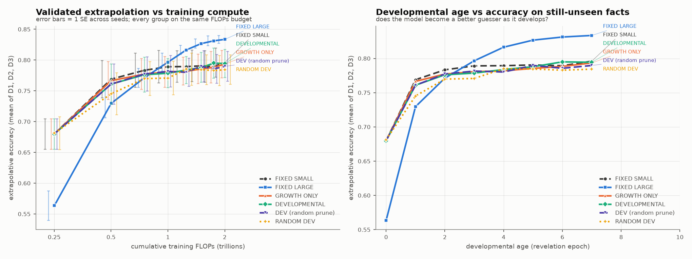
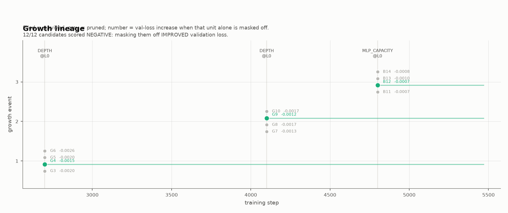
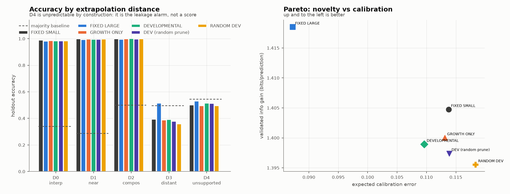
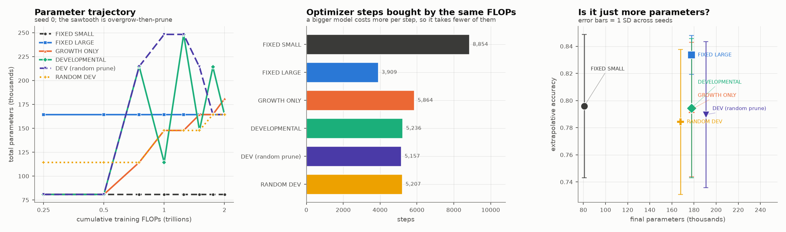

# RESULTS_001.md

**Verdict: NO-GO.**

Developmental growth was exactly function-preserving and fired on real evidence,
but it did not improve extrapolation at matched compute. The same architecture
trained from scratch beat every developmental variant — while taking **55%
fewer optimizer steps**.

Protocol frozen in `EXPERIMENT_001.md` before any comparison run. 6 groups x 5
seeds = 30 runs, all at an identical 2.0e12 training FLOPs. All 30 ledger hash
chains verified. Tables are generated by `report.py` from `summary.json`; the
full set is in `results/exp001/tables.md`.

---

## 1. Headline

| group | params | steps | **PRIMARY** (mean D1-D3) | sd | D0 | D1 | D2 | **D3** | D4 (alarm) |
|---|---|---|---|---|---|---|---|---|---|
| A FIXED SMALL | 81k | 8,854 | 0.7960 | 0.053 | 0.988 | 0.997 | 0.998 | 0.393 | 0.500 |
| **B FIXED LARGE** | 178k | **3,909** | **0.8335** | **0.014** | 0.980 | 0.993 | 0.995 | **0.513** | 0.530 |
| C GROWTH ONLY | 178k | 5,864 | 0.7934 | 0.050 | 0.984 | 0.996 | 0.998 | 0.387 | 0.495 |
| D DEVELOPMENTAL | 178k | 5,236 | 0.7944 | 0.051 | 0.982 | 0.994 | 0.999 | 0.390 | 0.515 |
| D-RANDPRUNE | 191k | 5,157 | 0.7897 | 0.054 | 0.983 | 0.995 | 0.997 | 0.377 | 0.513 |
| R RANDOM DEV | 168k | 5,207 | 0.7843 | 0.054 | 0.983 | 0.997 | 0.998 | 0.358 | 0.494 |
| _majority baseline_ | | | _0.428_ | | _0.340_ | _0.287_ | _0.501_ | _0.497_ | _0.545_ |

Paired across seeds:

| comparison | mean diff | 95% CI (paired bootstrap) | d | seeds won |
|---|---|---|---|---|
| **D − A** | −0.0016 | [−0.0074, +0.0048] | −0.21 | **1/5** |
| **D − B** | −0.0392 | [−0.0856, +0.0072] | −0.64 | **2/5** |
| D − C | +0.0010 | [−0.0009, +0.0038] | +0.31 | 3/5 |
| **D − R** | **+0.0101** | **[+0.0052, +0.0159]** | **+1.42** | **5/5** |
| D − D_RANDPRUNE | +0.0047 | [−0.0010, +0.0093] | +0.71 | 4/5 |
| B − A | +0.0376 | [−0.0109, +0.0831] | +0.61 | 3/5 |



The crossover on the left panel is the whole story. FIXED LARGE starts **worst**
(0.564 at 0.25e12 FLOPs — it buys fewer steps per FLOP) and overtakes everything
at ~1e12. That is exactly the trade the developmental hypothesis was supposed to
win: be small and fast early, add capacity when you need it, get both. Every
developmental variant instead stayed pinned to FIXED SMALL for the whole budget.

---

## 2. Against the frozen criteria

| # | GO criterion | result |
|---|---|---|
| 1 | D beats A, CI excludes 0, >= 3/5 seeds | **FAIL** — −0.0016, CI spans 0, 1/5 |
| 2 | D beats the majority baseline on D1, D2, D3 individually | **FAIL** — D3 is 0.390 against a 0.497 baseline |
| 3 | D beats R | **PASS** — +0.0101, CI excludes 0, 5/5, d=+1.42 |
| 4 | D >= B, or better extrapolation-per-FLOP | **FAIL** — B is +0.039 ahead and 416.7 vs 397.2 accuracy/PFLOP |
| — | no catastrophic forgetting (>2 accuracy points) | **FAIL** — D drops 2.06 points; D-RANDPRUNE 3.21; R 3.05 |
| — | no leakage | **PASS** — every group's D4 z-score is negative |

Three NO-GO triggers fired, and the second is decisive:

- **D ≈ A after FLOPs matching.**
- **B ≥ D at matched FLOPs _and_ matched parameters.** B and D end at the *same*
  178k parameters and the same architecture. B wins. The advantage is not
  parameters, and it is not compute — it is *when* the parameters existed.
- **D3 is below its majority baseline for every group.**

---

## 3. Why: the grown capacity never became load-bearing

The mechanism is unambiguous. Ablating each unit and measuring the validation
loss increase it is responsible for:

| group | growth events | share of total ablation effect carried by units added during training |
|---|---|---|
| C GROWTH ONLY | 3.8 | **0.27%** |
| D DEVELOPMENTAL | 3.2 | **0.22%** |
| D-RANDPRUNE | 3.4 | 0.26% |
| R RANDOM DEV | 3.2 | 1.89% |

Per-unit, for D seed 0: the original units carry ablation effects of **+6 to +57
nats**; every grown unit carries **+0.004 to +0.045** — three to four orders of
magnitude less. The growth machinery worked perfectly and added capacity that
did essentially nothing.



Worse: at every growth event, **12 of 12 candidates scored a _negative_ marginal
contribution** — masking them off *improved* validation loss. The competition was
not choosing between good options; it was choosing the least-bad of four options
that were all slightly harmful. (This is why `min_gain` had to be disabled: with
the gain filter on, the honest answer was "prune everything", which collapses D
into A. See `RESEARCH_LOG.md`.)

Note the awkward detail for the hypothesis: R's grown units are **8x more
load-bearing** than D's (1.89% vs 0.22%) — random timing puts them in earlier, so
they get more steps to integrate — and R is the **worst-performing group**. More
integration of late-added capacity made things worse, not better.

---

## 4. The one thing that did work

**D beats R: +0.0101, CI [+0.0052, +0.0159], 5/5 seeds, d = +1.42.**

This is the cleanest positive result in the study, and it answers Question 2 in
the affirmative: growth triggered by a validation-loss plateau is measurably
better than growth triggered by the clock, at a matched event count, matched
kinds, and matched parameter trajectory.

It is also almost worthless, because D does not beat *not growing at all*. The
controller is better than random at deciding when to do a thing that does not
help. Question 2 passes inside a regime where Question 1's premise fails.

D − D_RANDPRUNE is +0.0047 with a CI spanning 0 (4/5 seeds): weak, non-significant
evidence that competitive selection beats random selection. Given that all
candidates were harmful, this is best read as "picking the least-harmful of four
is slightly better than picking at random", not as a validation of competition.

---

## 5. D3: the models are confidently, systematically backwards

D3 asks: HEAVIER(e1, e2) where one entity sits at a latent period that appears in
**no** HEAVIER training fact. Its period *is* stated (a SHELL fact at age 0) and
`mass = 12·period + 2·group` is learnable from periods 0-6, so the answer is
derivable. Every group scores **below** the 0.497 baseline. Below-chance is a much
stronger claim than "failed to learn", so `analyze_d3.py` decomposes it:

| model | distant entity truly **heavier** (n=1384) | truly **lighter** (n=16) | mean confidence |
|---|---|---|---|
| A FIXED SMALL | **0.191** | 1.000 | 0.987 |
| D DEVELOPMENTAL | **0.197** | 1.000 | 0.970 |
| **B FIXED LARGE** | **0.578** | 0.833 | 0.971 |

A and D never learn mass as a composable function of period and group. They learn
a **per-entity** mass, which for an entity in no HEAVIER fact is simply untrained —
and an untrained mass reads as *light*. So they answer "the unfamiliar one is
lighter" at **98.7% confidence**, which is exactly backwards, because period-7
entities are the heaviest things in the world. They are not merely ignorant; they
are worse than ignorance (a coin flip scores 0.497).

B, with the same architecture available from step 0, gets 0.578 — it partially
induces the rule. **This is the finding.** The capacity has to be present while
the representation is forming. Adding the identical capacity 2,700 steps later
does not recover it, and no controller, competition, or pruning rule applied to
late-added capacity changed this by more than a percentage point.



D0/D1/D2 are saturated (0.98-1.00) for every group and carry no discriminative
signal — an honest limitation, discussed in §7.

---

## 6. Compute accounting

| group | train FLOPs | steps | tokens | wall s | peak RSS MB | inference FLOPs/token | accuracy / PFLOP |
|---|---|---|---|---|---|---|---|
| A FIXED SMALL | 2.000e+12 | 8,854 | 4.53M | 177 | 717 | 147,072 | 397.9 |
| B FIXED LARGE | 2.000e+12 | 3,909 | 2.00M | 162 | 723 | 339,686 | 416.7 |
| C GROWTH ONLY | 2.000e+12 | 5,864 | 3.00M | 176 | 723 | 339,686 | 396.6 |
| D DEVELOPMENTAL | 2.000e+12 | 5,236 | 2.68M | 182 | 737 | 339,686 | 397.2 |
| D-RANDPRUNE | 2.000e+12 | 5,157 | 2.64M | 182 | 737 | 365,901 | 394.8 |
| R RANDOM DEV | 2.000e+12 | 5,207 | 2.67M | 169 | 722 | 320,026 | 392.1 |

FLOPs match to four significant figures. The step counts show the budget doing its
job: growing costs steps (A 8,854 → D 5,236), and D gives up a further
628 steps relative to C to pay for running four candidates through each
competition window.

**B wins on every axis at once** — highest accuracy, highest accuracy-per-FLOP,
lowest seed variance — while taking the fewest steps of any group. There is no
compute story that rescues the developmental result.

Calibration and novelty tell the same story — B is better calibrated (ECE 0.087
vs D's 0.110) and extracts more validated information per prediction, and no
group trips the leakage alarm:

| group | info gain (bits/pred) | Brier | ECE | D4 leakage z | leakage flag |
|---|---|---|---|---|---|
| A FIXED SMALL | 1.405 | 0.2333 | 0.1138 | -1.54 | no |
| B FIXED LARGE | 1.419 | 0.1922 | 0.0872 | -0.59 | no |
| C GROWTH ONLY | 1.400 | 0.2368 | 0.1131 | -1.69 | no |
| D DEVELOPMENTAL | 1.399 | 0.2330 | 0.1096 | -1.08 | no |
| D-RANDPRUNE | 1.397 | 0.2394 | 0.1138 | -1.13 | no |
| R RANDOM DEV | 1.396 | 0.2474 | 0.1184 | -1.72 | no |



---

## 7. The strongest alternative explanation

*The experiment had no resolution, so "no difference" is uninformative.*

This is the serious objection and it is partly correct.

D0, D1 and D2 saturate at 0.98-1.00 for every group. The primary endpoint is
therefore effectively `(2.0 + D3)/3`, and all the variance lives in one bucket.
Two of the three extrapolative buckets contributed nothing.

Three things argue the study is still informative:

1. **The same measurement had no trouble separating B.** B is +0.039 above D on
   the identical endpoint, with 5/5 seeds above 0.819 and a seed SD of 0.014
   against D's 0.051. A measurement that resolves B − A resolves D − A if one
   exists.
2. **The mechanism is measured directly, not inferred from the null.** Grown units
   carry 0.22% of the model's ablation effect. That is not a power problem.
3. **D − R was detected**, at +0.010 with 5/5 seeds. The design can find a
   1-point effect.

What I would *not* claim: that this generalises above 0.2M parameters. The
capacity-vs-rule trade-off that drives D3 is exactly the kind of thing that moves
with scale, and a pilot at 0.16M showed D3 *degrading* with training where this
one shows it improving with capacity. See §8.

A second alternative, which I think is the real one: **a validation-loss plateau
is not a capacity signal.** The controller fires when learning stalls, but by then
the learnable structure has been learned and what remains is either noise (OMEN)
or a rule the representation can no longer form (D3). Growth arrives after the
representation has set. That is a criticism of the trigger, not of the operators —
and it suggests the hypothesis would need a genuinely capacity-bound task to get a
fair test, which this world, despite two attempts to make it one, is not.

---

## 8. Limitations, stated plainly

- **Scale.** 0.077M → 0.178M parameters, against the brief's 10-30M → <100M. The
  container is 4 CPU cores with no GPU. `configs/exp001_paper_scale.json` holds
  the requested configuration. **No result here should be assumed to transfer.**
- **n = 5 seeds.** Every CI above is a paired bootstrap on five numbers. The
  D − B and B − A comparisons both have CIs spanning zero; only D − R and the
  saturation results are comfortable.
- **Two of three primary buckets are saturated** (§7).
- **One operator family.** Depth and MLP-branch growth only; `d_model` never
  grows. A `d_model` operator (MSG-style) might behave differently.
- **D-RANDPRUNE ended 13k parameters heavier than D** (191k vs 178k) because the
  controller is evidence-driven and the runs diverge after their first growth
  event. It is a slightly favourable comparison for D, and D still only wins 4/5.
- **The forgetting failure is marginal and noisy** — D's worst drop is 2.06 points
  against a 2.00 threshold, measured on a 500-step horizon.

---

## 9. What I would do next — and it is not Experiment 002

The brief's plan was: if this works, add a teacher model. It did not work, and
adding a teacher to a system whose added capacity carries 0.22% of the functional
load would be building on nothing.

The result that deserves follow-up is the one that was not the hypothesis:
**B beat D at identical architecture and identical compute**, and the D3
decomposition says why. That points at a sharper and cheaper question:

> Is there a point in training after which a representation can no longer absorb
> new capacity — and can it be measured?

Concretely, and still small:

1. **Growth-time sweep.** One group, one operator, growth forced at a fixed step
   swept from 0 to 90% of the budget. If load-bearing share falls off with growth
   time, that curve is the finding, and it is a real and publishable one. This
   costs about what this study cost.
2. **A genuinely capacity-bound task.** This world's rules are simple enough that
   81k parameters saturate three of five buckets. Until FIXED SMALL plateaus at a
   high error *for capacity reasons*, no growth experiment is being given a fair
   test. This is the precondition, and I did not achieve it in two attempts.
3. **Only then** revisit the controller. It already beats a random schedule
   (5/5 seeds); it is not the bottleneck.

Experiment 002 (teacher/critic/adversary) and 003 (historical scientific corpora)
should wait until (1) and (2) say there is a phenomenon to teach.

---

## 10. Reproducing

```bash
python3 tests/test_gates.py                        # 23/23
python3 run_experiment.py --config configs/exp001_cpu.json --seeds 0,1,2,3,4
python3 evaluate.py  --runs 'results/exp001/*/'
python3 report.py    > results/exp001/tables.md
python3 visualize.py
python3 analyze_d3.py --run results/exp001/B_s0
```

Runs are deterministic: this grid was executed twice (the second time after
adding per-category accuracy logging) and the primary endpoint reproduced to four
decimal places in all five non-control groups. `ledger_manifest.json` records each
run's prediction count and terminal chain hash.
